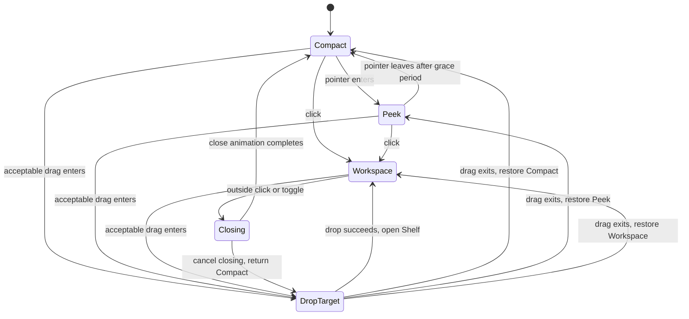

# Notch Workspace 产品与技术方案

状态：Implementing
范围：悬浮面板 2.0、展开指引、统一面板状态、文件暂存架、剪贴板历史
原则：保留“轻量状态岛”的核心体验，把高频操作放进点击展开后的临时工作区

## 实施记录（2026-08-10）

- Phase 0 已落地：`PanelState` reducer、过期 effect revision、统一 `NotchLayout`、AppKit 16ms resize 合并/120Hz frame timer 与 outside-click 投影均已接入；Clipboard 正文未被技术探针读取。
- Phase 1 的 Workspace 导航和永久“点击展开”提示已落地；116pt 双卡 Peek 经真实反馈后已撤回，当前按产品决定恢复 v26.8.4.2327 的 74pt 三栏 Peek 与旧版动画，电源与通知旧内容映射完整保留。
- Phase 2 代码已落地：会话级 actor 存储、20 项上限、去重/失效状态、AppKit 文件拖放目标、文件选择器、拖出、打开、Finder 定位、复制、移除和清空；不会移动、复制或删除原文件。
- Phase 3 代码已落地：Clipboard History 默认关闭，显式启用后按 500ms `changeCount` 变化读取文本、PNG/JPEG/TIFF 与本地文件 URL；支持会话/1 天/7 天、50 项/24 MiB 清理、自写回抑制、暂停恢复与异步缩略图。
- 自动验证当前通过 88 项测试及 Debug arm64 构建；加入 Phase 3 后的 Release universal 也已重跑，`x86_64 + arm64` 架构和严格签名校验通过。Finder/第三方拖放、外接显示器和目标 macOS 首次剪贴板访问提示仍是发布门槛，不以自动测试替代。

## 1. 结论

Notch Triage 不应直接变成一个堆叠功能的工具箱。下一阶段采用四层交互模型：

1. **Compact**：常驻小状态，继续承担一眼可见的信息提示。
2. **Peek**：鼠标悬浮后提供更宽松、可读、可点击的状态预览和展开指引。
3. **Workspace**：点击展开后的完整工作区，承载电源、通知、文件暂存与剪贴板。
4. **Transient**：系统 HUD、拖放目标、成功反馈等短暂状态，按明确优先级覆盖前述界面。

开发顺序固定为：

1. 面板状态重构，不改变现有功能。
2. 悬浮面板 2.0 与永久展开指引。
3. 文件暂存架 MVP。
4. 剪贴板历史 MVP。
5. 跨显示器、辅助功能、性能和隐私验收。

## 2. 用户反馈转译

| 原始反馈 | 真正问题 | 产品响应 |
| --- | --- | --- |
| 悬浮区域小、布局局促 | 曾尝试 116pt 卡片式 Peek，但收起动画和视觉体量不符合预期 | 保留 74pt 紧凑三栏 Peek，通过中央“点击展开”提示引导进入完整 Workspace |
| 不知道可以点击展开 | 交互缺乏稳定的 disclosure affordance | 永久显示“点击展开”与展开箭头 |
| 需要文件拖动暂存 | 用户希望在跨 App 工作流中临时“接住”文件 | 增加会话级文件 Shelf，支持拖入、拖出和替代操作 |
| 需要剪贴板 | 用户希望重复使用刚复制的内容 | 增加隐私优先、显式开启的本地 Clipboard History |

## 3. 目标与非目标

### 3.1 目标

- 新用户无需阅读 README，也能发现点击展开操作。
- Peek 状态可以舒适阅读，但不抢占桌面注意力。
- 文件可以从 Finder 等 App 拖入刘海，稍后再拖到其他 App。
- 剪贴板记录清晰说明采集范围、保存时长和清除方式。
- 系统 HUD、悬浮、展开、拖放和关闭动画不会互相抢状态。
- 所有核心操作支持键盘或按钮替代路径，不只依赖拖放。

### 3.2 非目标

- 第一版不复制或上传暂存文件，不提供云同步。
- 第一版不做 OCR、内容改写、固定片段、跨设备历史或团队分享。
- 第一版不做无限剪贴板历史；采用保守类型白名单并跳过已知敏感标记，但明确说明无法识别所有第三方 App 的秘密内容。
- 第一版不允许用户任意调整每个像素级尺寸。
- 不在 Compact 状态塞入文件列表或剪贴板列表。

## 4. 交互架构

### 4.1 状态机

当前实现同时维护 `isExpanded`、`isPanelClosing`、`isNotchCanvasExpanded`、`isHoveringNotch` 和 `systemHUD`。继续加入拖放与剪贴板会产生难以推断的组合状态，因此需要先建立单一状态来源。

建议新增一个由 reducer 独占写入的状态结构：

- `mode` 保存用户当前的基础界面。
- `presentationOverride` 保存会暂时接管几何和命中区的 DropTarget 或更新安装界面。
- `overlay` 只承载可以叠加在基础界面上的 HUD 和成功反馈。
- `effectRevisions` 分别为延迟收起、关闭完成、HUD 过期和更新效果提供令牌，互不误伤。

视图和 AppKit controller 不再各自组合布尔值：

```swift
struct PanelState: Equatable {
    var mode: PanelMode = .compact
    var presentationOverride: PanelOverride?
    var overlay: PanelOverlay?
    var isPointerInside = false
    var effectRevisions = PanelEffectRevisions()
}

struct PanelEffectRevisions: Equatable {
    var hover: UInt64 = 0
    var close: UInt64 = 0
    var hud: UInt64 = 0
    var update: UInt64 = 0
}

enum PanelMode: Equatable {
    case compact
    case peek(PeekContext)
    case workspace(WorkspaceSection)
    case closing(WorkspaceSection)
}

enum PeekContext: Equatable {
    case hover
    case onboarding
}

enum PanelOverlay: Equatable {
    case systemHUD(SystemHUDSnapshot)
    case shelfConfirmation(itemCount: Int)
}

enum PanelOverride: Equatable {
    case installingUpdate(returnSection: WorkspaceSection)
    case updatePrompt(id: UUID, returnSection: WorkspaceSection)
    case dropTarget(DropSession)
}

struct DropSession: Equatable {
    let id: UUID
    let acceptance: DropAcceptance
    let returnMode: RestorablePanelMode
}

enum RestorablePanelMode: Equatable {
    case compact
    case peek(PeekContext)
    case workspace(WorkspaceSection)
}

enum DropAcceptance: Equatable {
    case accepted(itemCount: Int)
    case partial(accepted: Int, rejected: Int, reason: String)
    case rejected(reason: String)
}

enum WorkspaceSection: String, CaseIterable {
    case power
    case notifications
    case shelf
    case clipboard
}
```

`PanelState` 决定几何尺寸、命中区域、主要内容和临时覆盖。系统 HUD 到达 Compact/Peek 时，计算后的 canvas 至少使用 Peek 尺寸；系统 HUD 到达 Workspace 时只叠加顶部反馈，不关闭用户正在看的页面。DropTarget 通过 `returnMode` 恢复进入拖放前的 Compact、Peek 或 Workspace；如果从 Closing 进入，先取消关闭 effect，并把返回状态规范化为 Compact。服务健康、媒体状态、通知数据等继续作为独立业务数据，不塞进状态机。



HUD 不在图中改变基础 mode：它写入 `overlay`。Compact/Peek 的 HUD 只临时提升有效 canvas 高度，Workspace 的 HUD 只显示顶部覆盖层；过期后清除 overlay。可操作的 Release update prompt 与更新安装写入 `presentationOverride`，安装结束后回到记录的 Workspace section。

### 4.2 状态优先级

从高到低：

1. 正在安装更新的不可中断界面。
2. 等待用户处理的 Release update prompt。
3. 有效文件拖放目标。
4. 已由用户打开的 Workspace。
5. 系统 HUD。
6. 首次展开提示。
7. 普通 Hover Peek。
8. Compact。

规则：

- 拖入有效文件时取消 closing，立即进入 `dropTarget`。
- 从 Compact、Peek、Workspace 进入 DropTarget 时保存精确 `returnMode`；拖离时按 session ID 恢复，旧 drag session 的退出事件无效。
- Workspace 已展开时，系统 HUD 不替换整个工作区，只在顶部提供短暂、非模态反馈。
- 正在拖放时不触发 hover 自动收起。
- Release update prompt 或更新安装期间忽略拖入事件和普通 panel 点击，只接受提示按钮/安装流程本身的事件。
- `hudReceived` 在 installing、updatePrompt、DropTarget 和 Closing 期间直接丢弃，不排队、不创建 expiry token；恢复后只显示新到达的 HUD，避免陈旧反馈覆盖当前任务。
- closing 过程中再次点击或拖入时，应取消旧关闭任务并使用新的 revision，过期动画不得写回状态。
- 新手提示只改变 Peek 内容；第 3 次曝光或首次成功展开后，下一次 reducer 事件降级为普通 Hover Peek。
- Reduce Motion 开启时保留状态变化和透明度反馈，移除大幅缩放和弹性移动。

### 4.3 事件、效果与令牌

Reducer 只同步返回新状态和 effects，不直接创建 `Task` 或 `Timer`。`AppModel` 执行 effect，并把带 token 的完成事件重新送入 reducer。只有 token 与对应的 `effectRevisions` 域，或 drag session ID 相同，事件才允许修改状态。AppKit 的 frame animation `resizeRevision` 继续由 `NotchPanelController` 独立维护，不能与业务 effect token 混用。

| Event | 同步状态变化 | Effect / 取消规则 |
| --- | --- | --- |
| `pointerEntered` | 无 override 时 Compact → Peek；按 hint policy 选择 onboarding/hover | 取消 hover collapse；override 存在时只更新 pointer 输入，不改 presentation |
| `pointerExited` | 暂不立即改变 | 无 override 时安排 130ms collapse；override 存在时只更新 pointer 输入 |
| `toggleWorkspace` | 无 override 时 Compact/Peek → 上次 section；Workspace → Closing | override 存在时忽略；否则取消 hover collapse，HUD expiry 继续，关闭时安排 completion |
| `outsideClicked` | 无 override 的 Workspace → Closing | 仅命中 visible surface 之外时生效；任一 override 下忽略 |
| `hudReceived` | 无 override 且不在 Closing 时更新 HUD overlay；Compact canvas 至少提升到 Peek | installing/updatePrompt/drop/closing 时丢弃且不发 effect；否则取消旧 expiry 并安排新 HUD token |
| `dragEntered` | 保存 returnMode，设置 DropTarget override | 取消 closing/hover collapse；updatePrompt 或安装中忽略 |
| `dragExited(sessionID)` | 清除 DropTarget，恢复 returnMode | session ID 不匹配时忽略 |
| `dropSucceeded(sessionID)` | 清 override，进入 Workspace Shelf | 设置成功 overlay；旧 session 忽略 |
| `updatePromptRequested` | 清普通 overlay，设置 updatePrompt override | 取消 closing、drag、HUD expiry；确保 Workspace 可见 |
| `updatePromptDismissed` | 清 prompt override，回到记录 section | 过期 prompt ID 忽略 |
| `installStarted` | 从 prompt 或 Workspace 进入 installing override | 清普通 overlay；取消 closing、drag、HUD expiry 和可冲突输入 |
| `installFinished` | 清 override，回到记录 section | 根据更新结果继续现有重启/错误流程 |
| `activitySuspended` | 通过 reducer 清 HUD overlay，基础 mode 保持 | 递增 HUD revision、取消 expiry，并暂停 ClipboardMonitor |
| `activityResumed` | 基础 presentation 不变 | 恢复已启用的 ClipboardMonitor；不补录休眠期间内容 |

### 4.4 AppKit 几何与事件约束

现有 NSPanel 为避免 macOS constraint re-entry，使用一帧 16ms 合并、120Hz frame timer 和 resize revision。Phase 0 必须保留这些保护，不能在 `@Published`/SwiftUI constraint 回调中同步 resize。

`NotchLayout`/`PanelGeometry` 必须同时返回：

- `windowFrame`
- `visibleSurfaceFrame`
- `hoverTrackingFrame`
- `dropHitFrame`

outside-click monitor、SwiftUI surface、AppKit panel frame 和 DropTarget 命中统一使用这些结果，禁止继续硬编码 `520 × (74 + 16 + 460)`。`NotchHoverTracker` 要挂在实际可见的 74pt Peek surface 上，透明 gutters 不参与 hover/click。拖出 Shelf 时 local/global monitor 暂停自动关闭，直到 drag session 结束，不能吞掉目标 App 的 mouse/drag 事件。

### 4.5 独立业务 UI 的边界

并非所有短暂内容都必须塞进 `PanelState`，但必须禁止它们改变几何或绕过优先级：

- `notificationPulse` 继续作为通知业务信号。它只能在 `mode == .compact`、无 presentationOverride、无 HUD overlay 时绘制在 Compact 中央；`pulseTask` 不得写 mode、override、frame 或 hit-test。
- `updatePrompt` 的内容数据继续由更新领域持有；Release update prompt 的“是否占据面板并阻断输入”由 `PanelOverride.updatePrompt` 决定。
- 非 Release 的修复/错误 alert 继续使用系统 Alert，但只允许由 Workspace 或 Settings 呈现，不改变 panel geometry；alert 存在时 DropTarget 与普通 panel 输入关闭。
- 媒体、通知列表、Codex、废纸篓和电源快照都是业务数据，只根据最终 presentation 渲染，不参与 panel reducer。

## 5. 悬浮面板 2.0

### 5.1 尺寸

| 项目 | 当前 | 建议初始值 |
| --- | ---: | ---: |
| Panel window 宽度 | 560pt | 保持 560pt |
| Peek 黑色表面宽度 | 随左右翼内容变化 | 保持随左右翼内容变化，不再强制 480–520pt |
| Peek 总高度 | 74pt | 74pt（116pt 方案已撤回） |
| Peek 内容带高度 | 约 37–42pt | 约 76–82pt |
| Workspace 内容 | 520×460pt | 第一阶段保持不变 |

尺寸集中到 `NotchLayout`，禁止 `NotchRootView` 和 `NotchPanelController` 各自维护一份 `hoveredHeight`。

### 5.2 布局

- 顶部继续与实体刘海和菜单栏对齐。
- 内容区保留左右两张主要状态卡，展示用户选择的左右翼内容。
- 卡片使用图标、主数值、简短标签和必要的进度，不使用密集的 1px 分隔线。
- 中央下方保留独立的 disclosure affordance，不再让通知数量取代展开箭头。
- 媒体卡优先显示封面、标题、播放状态和进度；无媒体时降级为简洁空状态。
- 文本至少支持系统默认字体缩放和 VoiceOver 合并朗读。

### 5.3 展开指引

展开提示采用永久的上下文指引，不使用首次启动弹窗。Apple HIG 建议把针对某个区域的说明放在该区域附近；disclosure 控件也应紧邻其展开的内容。

逻辑：

1. 每次普通 Hover 都显示 `⌄ 点击展开`，不按次数或是否曾展开而隐藏。
2. 有通知时优先显示通知 badge；无通知时显示永久展开指引。
3. HUD、拖放和 closing 状态继续使用各自的瞬态内容。
4. 整块 Peek 表面可点击，但按钮按下不改变亮度或缩放。

## 6. Workspace 导航

现有完整面板只有“电源”和“通知”两个图标分段。加入 Shelf 与 Clipboard 后，改为带文字的四段导航：

- 电源
- 通知
- 暂存
- 剪贴板

旧内容到新导航的映射在首版保持不变，禁止借导航改造删除或重新解释现有功能：

| 旧 section | 新 section | 必须保留的内容 |
| --- | --- | --- |
| Power | 电源 | 完整 `PowerDashboardView` |
| Triage | 通知 | `NotificationInbox`、`CodexUsageCard`、`TrashCompactCard`、`NowPlayingStrip` |
| 无 | 暂存 | 新 File Shelf |
| 无 | 剪贴板 | 未启用说明或 Clipboard History |

要求：

- 使用图标 + 短文字，不依赖用户猜图标含义。
- 设置按钮保持独立，不占用一个 section。
- `WorkspaceSection` 由 `AppModel` 持有，使用 `notch.workspace.lastSection` 记住上次选择；拖放成功后写入 Shelf。
- section 持久化必须测试无值、旧值、非法值和拖放覆盖场景。
- Clipboard 未开启时仍显示入口，页面内解释用途并提供“启用”按钮。

## 7. 文件暂存架 MVP

### 7.1 语义

Shelf 是“临时引用架”，不是文件备份：

- 接受本地文件和文件夹 URL，支持多选拖入。
- 不移动、不复制、不修改原文件。
- 默认仅当前 App 会话有效，退出后清空。
- 最多 20 项，按标准化路径去重。
- 原文件被移动或删除时显示“项目不可用”，不静默删除记录。
- 当前工程保持非沙盒配置；本阶段不能为了 Shelf 单独切换 App Sandbox，以免同时改变辅助功能、Finder 自动化、Updater 和媒体适配器的权限边界。
- 如果未来整体迁移到 App Sandbox，再单独设计 user-selected file entitlement 与 security-scoped bookmark 生命周期。

### 7.2 拖入流程

1. 指针携带受支持文件进入刘海命中区。
2. 150ms 内设置 `PanelOverride.dropTarget`，其中 acceptance 为 accepted/partial/rejected，并展示对应反馈。
3. 不支持的类型显示 `circle.slash` 和原因，不接收 drop。
4. 成功 drop 后显示项目数量反馈，并打开 Workspace 的 Shelf section。
5. 拖离命中区 200ms 后恢复此前状态，防止边缘抖动。

### 7.3 Shelf 页面

每项展示：

- 文件图标或安全生成的缩略图。
- 文件名、类型与简洁大小信息。
- 不可用状态。

操作：

- 从 Shelf 再次拖出到 Finder 或其他 App。
- 打开。
- 在 Finder 中显示。
- 复制。
- 从暂存架移除。
- 全部清空。
- “添加文件…”按钮，作为拖放的替代操作。

拖出文件必须使用系统支持的数据表示，确保跨 App 拖放表现符合 macOS 习惯。Apple HIG 建议支持多项目、明确高亮有效目标，并提供拖放之外的替代操作。

### 7.4 失败反馈

- drop 解析失败时保留面板并说明失败原因。
- 超过 20 项时接收可容纳部分，并明确报告其余项目未加入。
- 权限或文件提供者尚未下载完成时显示等待/失败状态，禁止阻塞主线程。
- 清空只清除引用，不删除磁盘文件，因此无需破坏性确认框。

## 8. 剪贴板历史 MVP

### 8.1 开启方式与隐私

- 默认关闭监控。
- 首次进入 Clipboard 页面时说明：读取范围、保存位置、保存时长和清除方式。
- 用户主动点击“启用剪贴板历史”后才开始读取 `NSPasteboard.general`。
- 所有内容仅保存在本机，不上传、不进入诊断日志、不用于分析。
- 关闭功能时停止监控，并询问是否同时清除已有历史。
- 目标 macOS 上必须单独验证 pasteboard access alert 和系统设置中的授权行为，未完成前不得默认开启。
- 启用页明确提醒：系统剪贴板可能包含密码、令牌和个人信息；过滤只能覆盖已知类型，用户应选择合适的保留时长并可随时清空。

Apple 的 [`NSPasteboard`](https://developer.apple.com/documentation/appkit/nspasteboard) 文档说明通用 pasteboard 由所有 App 共享，[`changeCount`](https://developer.apple.com/documentation/appkit/nspasteboard/changecount) 会在所有权变化时递增；这适合做低成本变更检测，但读取内容仍必须遵守明确授权和最小化原则。

### 8.2 支持内容

第一版只读取白名单类型并规范化保存：

- 纯文本。
- 图片 PNG/JPEG 表示与缩略图。
- 本地文件 URL 列表。

不保存：

- 已知被标记为 concealed、transient、自动生成或其他敏感声明的内容。
- 空白内容。
- 单项超过 10MB 的图片数据。
- 无法安全规范化的私有 pasteboard 类型。

### 8.3 保存策略

- 默认保存到 App 退出；用户可选 1 天或 7 天。
- 默认最多 50 项。
- 连续相同内容去重，只更新时间。
- App 自己执行“再次复制”时记录 changeCount/fingerprint，避免产生重复项。
- 现有 `copyDiagnosticReport()` 与 Clipboard History 的“再次复制”必须走同一个写回协调器：只有用户明确复制时才替换 general pasteboard，并登记自写 token。
- 监控、删除历史、清空历史和关闭功能绝不能调用 `NSPasteboard.clearContents()`；这些动作不得改变用户当前的系统剪贴板。
- “保存到 App 退出”时历史仅驻留内存；选择 1 天或 7 天后，文本索引与元数据才写入 Application Support，图片单独存为文件，禁止塞入 UserDefaults。
- 启动时清理上次异常退出留下的会话级临时图片，避免“仅本次会话”名不副实。
- 定期按数量、过期时间和总磁盘预算清理。

### 8.4 页面能力

- 按时间倒序展示类型、摘要、来源时间和缩略图。
- 单击项目将其重新写入剪贴板，并显示成功反馈。
- 支持单项删除和全部清空。
- 第一版不做搜索、固定收藏和内容编辑；数据结构保留后续增加这些能力的空间。

### 8.5 监控策略

- 仅在功能开启后监控 `changeCount`。
- 轮询间隔初始为 500ms；只在 changeCount 变化时读取具体数据。
- pasteboard 轻量访问与 UI 状态协调在主 actor，图片解码、缩略图和磁盘写入放到后台 actor。
- App 锁屏、休眠和退出时正确暂停；恢复后不批量伪造缺失历史。
- 监控器必须可注入假的 pasteboard 适配器，以便测试去重和敏感内容过滤。
- `PasteboardAccessing` 协议封装 changeCount、读取与明确写回，测试不得直接依赖系统 general pasteboard。

## 9. Apple 设计基线

方案按以下官方原则执行：

- [Onboarding](https://developer.apple.com/design/human-interface-guidelines/onboarding)：提示应快速、可选、可交互，并靠近所解释的界面。
- [Disclosure controls](https://developer.apple.com/design/human-interface-guidelines/disclosure-controls)：展开箭头应明确表达展开/收起状态，并靠近关联内容。
- [Drag and drop](https://developer.apple.com/design/human-interface-guidelines/drag-and-drop)：支持多项目、有效目标高亮、失败反馈和替代操作。
- [Feedback](https://developer.apple.com/design/human-interface-guidelines/feedback)：状态反馈应在相关位置就地呈现，避免用不必要的警告打断用户。
- [Privacy](https://developer.apple.com/design/human-interface-guidelines/privacy)：本地存储和私有数据访问应采用系统能力、明确用途并降低暴露范围。

## 10. 代码影响面

### 10.1 建议新增

| 文件 | 职责 |
| --- | --- |
| `NotchTriage/PanelState.swift` | 状态、事件、reducer、过期任务令牌和优先级 |
| `NotchTriage/NotchLayout.swift` | Compact、Peek、Workspace、DropTarget 统一尺寸 |
| `NotchTriage/FileShelfModels.swift` | Shelf item、DropSession、accepted/partial/rejected 结果 |
| `NotchTriage/FileShelfStore.swift` | 会话级文件引用、去重、容量与失效检测 |
| `NotchTriage/FileShelfView.swift` | Shelf 列表、空状态和项目操作 |
| `NotchTriage/NotchDropTargetView.swift` | 拖入识别、有效性反馈和 drop 接收 |
| `NotchTriage/PasteboardAccess.swift` | 可注入的 general pasteboard 读取/明确写回协议 |
| `NotchTriage/ClipboardMonitor.swift` | pasteboard changeCount 监控与内容读取 |
| `NotchTriage/ClipboardStore.swift` | 去重、保留策略、本地索引和磁盘预算 |
| `NotchTriage/ClipboardHistoryView.swift` | 历史列表、恢复复制与清理操作 |

### 10.2 建议修改

| 文件 | 修改 |
| --- | --- |
| `NotchTriage/AppModel.swift` | 用 reducer 管理的 `PanelState` 取代多个面板布尔状态；`showSystemHUD`、start/stop、activity pause/resume 和 Workspace section 全部发送事件 |
| `NotchTriage/AppDelegate.swift` | 根据 `PanelState` 计算 panel frame，接入 drag 命中区 |
| `NotchTriage/NotchRootView.swift` | 新 Peek 布局、展开提示、DropTarget 与四段 Workspace |
| `NotchTriage/SettingsRootView.swift` | Clipboard 开关与保留策略 |
| `NotchTriage/NotchTriageApp.swift` | 增加打开暂存/剪贴板的普通菜单命令；全局快捷键不进入 MVP |
| `NotchTriage/AppModel+Diagnostics.swift` | 诊断报告复制改走 pasteboard 写回协调器；`setBackgroundRefreshPaused` 通过 activity reducer 事件清 HUD，不再直接写 `systemHUD` |
| `NotchTriage/AppModel+Updates.swift` | 自动更新提示/安装不再直接写旧面板布尔状态，统一发送 updatePrompt/install reducer 事件 |
| `NotchTriage/BackgroundRefreshScheduler.swift` | AppActivityMonitor 暂停/恢复时同步控制 ClipboardMonitor；不把 500ms 轮询塞进普通刷新 job |
| `NotchTriage/SystemHUDService.swift` | 保持事件生产者职责；确认 callback 只发送 `hudReceived`，不再直接写旧 UI 字段 |
| `README.md` | Phase 4 更新功能、首次使用、隐私边界与人工验收说明 |

项目使用 File System Synchronized Groups，放入 `NotchTriage/` 和 `NotchTriageTests/` 的新 Swift 文件通常无需手工维护 PBX file reference，但实施时仍需用 Xcode build 验证 target membership。

## 11. 测试方案

### 11.1 自动测试

新增独立测试文件，避免继续把所有测试堆进 `NotchTriageModelTests.swift`：

- `PanelStateTests.swift`
  - Hover、click、outside click、closing、HUD、update、drag 的转换和优先级。
  - Compact/Peek/Workspace/Closing 进入 drag 后的 returnMode，以及过期 session/revision 不得覆盖新状态。
  - installing/updatePrompt/DropTarget/Closing 中的 `hudReceived` 被丢弃且不生成 expiry effect；恢复后新 HUD 正常显示。
  - activity suspend 只通过 reducer 清 HUD 并使旧 expiry token 失效；resume 不恢复旧 HUD、不补录剪贴板。
  - notification pulse 只在无 override/HUD 的 Compact 可见，且不能修改 mode/geometry。
- `PanelGeometryTests.swift`
  - 不同 menu bar/notch/screen 参数下，window、visible surface、hover tracker、drop hit 和 outside-click frame 保持一致。
- `FileShelfStoreTests.swift`
  - 多文件、去重、20 项上限、accepted/partial/rejected、provider error、缺失文件、清空不删除原文件。
- `WorkspaceSectionPreferenceTests.swift`
  - 无值、旧值、非法值、用户切换和 drag 成功强制 Shelf。
- `ClipboardStoreTests.swift`
  - changeCount、去重、容量、过期、自写回抑制、会话/1 天/7 天退出与重启语义。
- `ClipboardPrivacyTests.swift`
  - 已知敏感声明、白名单、超限图片、未知类型和关闭监控后的行为。
  - `copyDiagnosticReport()`/再次复制只产生一次显式写回且不会回流为新历史；清空历史不改变 general pasteboard。

### 11.2 手工验收矩阵

- 带刘海 Mac、无刘海外接显示器、多显示器切换。
- 普通桌面、全屏 Space、其他 App 前台、菜单栏自动隐藏。
- Reduce Motion、VoiceOver、键盘操作和更大文字。
- Finder、桌面、下载目录和第三方 App 的单文件、多文件、文件夹拖入/拖出。
- 原文件移动、删除、无权限、云文件未下载和超过容量。
- Safari、终端、截图、Finder 文件和常见密码管理器的复制行为。
- Clipboard 未开启时零轮询/零读取，以及开启、关闭、清空、退出重启、异常退出恢复、保留期限和磁盘预算。
- HUD、通知到达、拖放和点击展开同时发生时的优先级。

## 12. 性能与质量门槛

- Compact 和普通 Peek 不做磁盘 I/O。
- Clipboard 未启用时不得启动轮询任务。
- Clipboard 空闲监控不应造成可感知 CPU 或能耗提升；正式阈值以 Instruments 基线测量确定。
- 图片解码、缩略图、文件元数据和持久化不得阻塞主线程。
- 拖入有效目标后 100ms 内出现视觉反馈。
- 连续快速 Hover、点击和拖放不得出现窗口跳动、屏外残留或 App 无响应。
- 所有自动测试、Debug/Release universal build、codesign 与 DMG 校验通过后才能发包。

## 13. 分阶段交付与验收

### Phase 0：状态与布局基础

交付：

- `PanelState` 状态机和 reducer。
- `NotchLayout` 统一尺寸。
- 现有行为迁移，不改变视觉。
- NSPanel 的 16ms resize 合并、120Hz frame timer/revision、outside-click 和 hover tracker 迁移到统一 geometry。
- 目标 macOS clipboard access 行为技术验证，并把结论、系统提示和设置路径记录到 `docs/macos-pasteboard-access-spike.md`。

完成标准：

- 现有功能和动画无回归。
- reducer 自动测试覆盖全部转换。
- 当前重复的 `hoveredHeight` 和面板几何分支收敛到单一来源。
- `AppModel.swift` 与 `AppModel+Updates.swift` 不再直接写旧的 expanded/closing/canvas/hover 布尔状态。
- Debug build 与现有完整测试通过。
- 完成最小真实 NSPanel 验收：Hover、click、closing、连续 HUD、inside/outside click、带刘海/无刘海显示器和多屏切换。
- `windowFrame`、`visibleSurfaceFrame`、hover tracking 与 outside-click 命中在所有 mode 下使用同一 geometry 结果。

### Phase 1：Peek 2.0 与可发现性

交付：

- 74pt 三栏 Peek、中央“点击展开”指引与旧版无按压高亮交互。
- 永久显示 `点击展开` 与 disclosure affordance，不记录曝光次数。
- 四段 Workspace 导航外观就位，但电源与通知 section 严格保留旧内容映射。

完成标准：

- 新用户无需外部说明能发现并成功展开。
- 通知 badge、HUD 与箭头可以同时正确呈现。
- Hover 进出、点击、关闭和 Reduce Motion 无跳动。
- 74pt 可见 surface、AppKit panel frame、hover/click tracking 和透明 gutters 命中一致。
- `PowerDashboardView`、NotificationInbox、Codex、废纸篓和 Now Playing 均可从新导航访问。

### Phase 2：文件 Shelf

交付：

- 拖入目标、会话级暂存，并启用 Phase 1 预留的“暂存” section。
- 多项目、拖出、打开、Finder 定位、复制、移除和清空。
- 文件选择器替代入口。

完成标准：

- 原文件绝不被移动或删除。
- Finder 与至少两类第三方 App 的拖入/拖出通过。
- 失效、超限和失败都有明确就地反馈。
- accepted、partial、rejected、provider error 和取消均能恢复正确 returnMode，过期 session 事件无效。
- 从 nonactivating panel 拖出时不误触 outside-click 收起、不吞目标 App 事件，drag 结束后 monitor 正常恢复。

### Phase 3：Clipboard History

交付：

- 显式启用、监控器、历史存储、重新复制和清理。
- 文本、图片、文件 URL 白名单与已知敏感声明过滤。
- 会话/1 天/7 天保留策略。

完成标准：

- 默认关闭且说明清楚。
- 已知敏感声明与非白名单类型被跳过，且界面不宣称能够识别所有密码内容。
- Clipboard 未启用时不启动轮询、不读取 general pasteboard；不写入诊断日志。
- 会话保留在正常退出和异常退出后的下次启动均被清理；持久保留按 1 天/7 天过期。
- 目标 macOS 的 pasteboard access alert 与系统设置行为完成真实验证并记录结论。
- 重复、自写回、过期和容量清理测试通过。
- Instruments 验证无主线程长任务和明显空闲能耗回归。
- 正常退出、异常退出后的下次启动、关闭功能并选择保留/清除这三条生命周期均按文档执行。

### Phase 4：发布验收

2026-08-10 的首轮真实界面验收记录见
[`phase4-manual-acceptance-2026-08-10.md`](./phase4-manual-acceptance-2026-08-10.md)。
该记录只勾选已有证据的项目。大图片 Time Profiler 与约 10 分钟 macOS 资源趋势抽样已完成；Xcode `Power Profiler` 本身不支持 macOS，不再将该模板列为 macOS 发行门槛。跨 App 拖放、外接显示器、首次剪贴板授权和发行包验证仍保持阻断状态。

交付：

- 完整人工验收记录。
- README 功能说明、隐私说明和真实 UI 截图。
- 使用发布时刻生成版本号和 universal DMG。

完成标准：

- 自动、人工、权限、跨 App、跨显示器和发行包验证全部闭环。
- Release 回下载资产与本地包逐字节一致。

## 14. 发布前阻断项

以下任一项未解决时不应发布 Clipboard 正式版：

- 目标 macOS 的 pasteboard access alert/设置行为未实测。
- 敏感类型过滤没有自动测试。
- 关闭监控后仍继续读取 pasteboard。
- 内容进入诊断日志、崩溃日志附加信息或网络请求。
- 大图片处理可阻塞主线程。
- `copyDiagnosticReport()` 或“再次复制”被回流成重复历史。
- 监控、删除/清空历史或关闭功能会清除用户当前 general pasteboard。

以下任一项未解决时不应发布 Shelf 正式版：

- 拖入操作可能移动或删除原文件。
- 拖出无法被 Finder 或常用第三方 App 接收。
- 拖放过程中 panel 状态可卡在 DropTarget。
- 清空 Shelf 会误操作磁盘文件。
